# Byron's Help Pages
#### Edition 1.001

  
<strong>Table of Contents</strong>

- [Resources](#resources)
  - [Intro Videos](#videos)
  - [Compound Interest Calculator](#calculator)
  - [Questions & Answers](#qa)
- [Account(s) Setup](#acctsetups)
  - [Register with DSJ](#registerdsj)
  - [Download the DSJ App](#downloaddsj)
  - [Access DSJ from Web Browser](#dsjonweb)
  - [Record DSJ Information](#recorddsjinfo)
  - [Set up Kraken Account](#openkrakenacct)
- [Fund DSJ for Trading](#dsjfunding)
  - [Deposit Assets into DSJ from Kraken](#depositdsj)
  - [Confirm Initial DSJ Deposits](#dsjdepositconfirmation)
  - [Transfer DSJ Assets to Trading Wallet](#dsjtransfertotradewallet)
- [Bonchat Setup](#bonchatsetup)
  - [Bonchat Installation](#bonchatinstall)
  - [Bonchat Configuaration](#bonchatconfig)
- [Trading](#Trading)
  - [Following Regular Signals](#regularsignals)
  - [Following Bonus Signals](#bonussignals)
  - [Follow up on Your Trade](#tradefollowup)
- [Withdraw Profits from DSJ](#takingprofits)
  - [Capture Kraken Wallet Address](#capturekrakenwalletddress)
  - [Notify BG of Kraken Wallet Address](#notifybgofwalletaddress)
  - [Transfer Assets within DSJ from Trade to Exchange](#transferfromtradetoexchange)
  - [Withdraw Assets from DSJ into Kraken](#withdrawassetstokraken)

<!--------------------------------------------------------------->
<h2>Resources</h2>

<strong>Intro Videos</strong>
  
Here are some links to videos that provide greater depth into the system.  It may not be necessary to listen to all of them. However, the first one is highly recommended.

  - <u>Is BG Wealth Sharing Too Good To Be True?</u> on <a href="https://www.youtube.com/watch?v=tcBaJ0adA3E" target="forreal">YouTube</a> - 30 mins
  - BG Friday Call on <a href="https://www.youtube.com/watch?v=vu6ZxuU6P1o" target="FridayCall">YouTube</a> from 3/13/2026 - 52 mins
  - BG Wealth Sharing Group on <a href="https://screenrec.com/share/maTwh45sJV" target="screenrec">screenrec</a> - 67 mins

<strong>Compound Interest Calculator</strong>
  
The <a href="https://www.thecalculatorsite.com/finance/calculators/daily-compound-interest.php" target="calc">calculator</a> 
is a good tool to project your earnings and account balances based on your consistency and periodic withdrawals, etc.  Being consistent, you could expect 1.25% compounded daily returns.

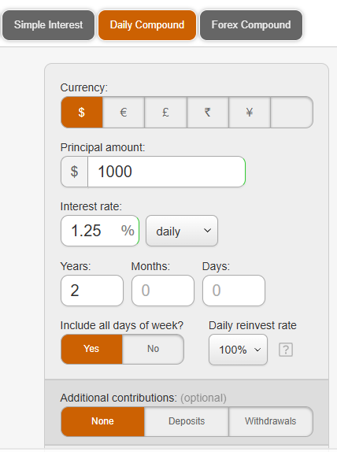

<strong>Questions & Answers</strong>
  

 How does this work with taxes?
 - You will not be getting any annual statements to file with the IRS, so work with an accountant or tax professional.  Keep track of your initial deposits and end of year balances to make it easy on yourself.  This is the official statement:  
   <i>
In the United States, tax laws vary by state. Cryptocurrency gains are considered capital gains, and if you have a profit at the end of the year, you’ll need to report it.  However, BG is an international platform and doesn't directly submit 1099 forms to the IRS like Coinbase, Binance, or other US-based exchanges. All your earnings on BG remain in your cryptocurrency wallet, considered decentralized assets, and the company will not report them on your behalf.  In other words, whether or not to declare [something] and how to declare it is entirely up to you; the platform will not proactively report your transaction data. Therefore, if you wish to fully comply with local laws, you can consult an accountant or tax advisor in your city or region.
</i>

<!--------------------------------------------------------------->
<h2>Account(s) Setup</h2>

<strong>Register with DSJ</strong>
  
DSJ Exchange can be accessed from a web browser or a mobile device.  For initial setup, you may consider using your mobile device.  Sometimes the URL for DSJ changes, and the mobile app you may have initially downloaded will no longer work.  This should not alarm you.  Just switch to the latest version or URL.  It is only a minor inconvenience. 

- Click your inviter's DSJ link (example: https://dsjvm.cc/?code=ak7r7tcipk00) 
  - <strong>This will be sent to you.</strong>
  -	You will want to install the app onto your mobile device, when prompted, but that can be done later.  Refer to the next step for further instruction.
- On the registration page, you can use your email or phone number to register.
-	Establish and confirm your password.
-	Click the word <strong>OBTAIN</strong> until you get a code you can read.  
-	Enter the code in the verification box and click <strong>Confirm</strong>.
    - If you used a phone number, it will send a verification code to your phone. 
    - Enter that code, then click <strong>Register</strong>.

<strong>Download the DSJ App</strong>
  

If you have not already done so throughout the registration, perform this process.
- After registering, scroll to the bottom of the signup page
- Click "DSJ Download App"
- Select your device type:
  - iOS (Apple)
  - Android
-	When prompted, allow the app to install on your mobile device.
    - On iPhone: go to Settings > Profile Downloaded, then finish installation.
-	Once complete, the DSJ app icon will appear on your device.

<strong>Access DSJ from Web Browser</strong>
  

Although not required, it is recommended to establish a web browser bookmark on your laptop or desktop computer.  The web version will appear different from the mobile app version, but should include the same functions.  The URL should be the same as the one you were provided (minus the code). (example: https://dsjvm.cc)

<strong>Record DSJ Information</strong>
  
Retrieve and record of your DSJ information for future use.  Save these values to be used later.

- Record your personal DSJ ID.  You will be asked for it later in the setup process.
  -	From the <strong>Account</strong> menu, click the <strong>Copy</strong> ICON to get your account number (DSJ ID) to clipboard and save that value.

    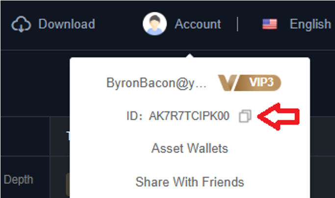

- Record your personal DSJ deposit wallet address for future use.  You will need it later to make a deposit(s) into your account to perform trades.
  -	From the <strong>Assets</strong> menu, click <strong>Deposit</strong>.

    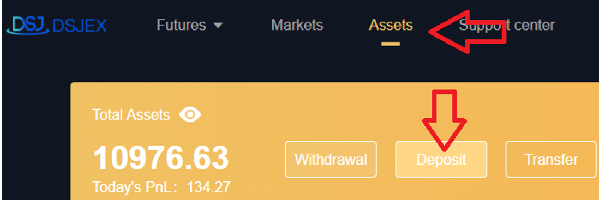

  - Select <strong>USDT</strong> as the deposit currency and <b>TRC20</b> for <b>Chain name</b>.
  - Click the <strong>Copy</strong> link to get wallet address to clipboard, and save that value.  
    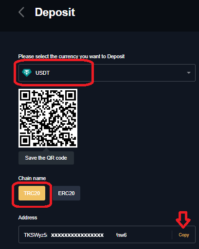

<strong>Set up Kraken Account</strong>

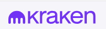

There are many options for digital currency wallets and exchanges.  I happen to prefer Kraken.  Therefore all of this reference material refers to Kraken, as I have had personal success with it as my favorite.  I like Kraken because I can use it to get assets both in and out of DSJ Exchange without dealing with volatile cryptocurrency and conversion of fractional shares.  However, you may choose whichever wallet or exchange to suit your preference.  

- Visit https://www.kraken.com/ to open an account.
- Fund your account.
  - From the <strong>Transfer</strong> option, select <strong>Deposit</strong>.

    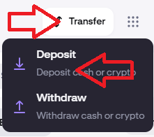
  - Select <strong>US Dollar</strong>.  
    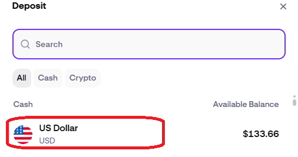
  - Select a method from which to fund your Kraken account, such as your US bank.  
    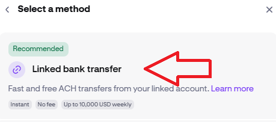
  - Proceed with remaining steps to deposit funds into your account.    
- Buy digital currency USDT from using the USDC funds you just deposited into you account.   
  - Click <b>Buy crypto</b> and select <b>USDT</b>.    
  - Once you've confirmed an amount, click <b>Review</b> to verify the transaction.    
  - When you are sure, click <b>Confirm</b> to complete the purchase.    
    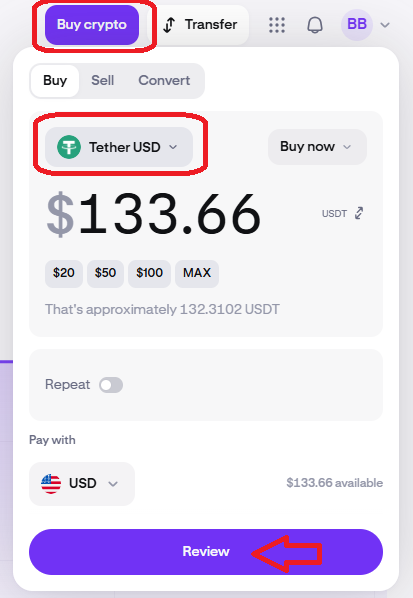

<!--------------------------------------------------------------->
<h2>Fund DSJ for Trading</h2>

<strong>Deposit Assets into DSJ from Kraken</strong>

You will need to be in you Kraken account to move assets into DSJ Exchange for trading.  In this process, you are transferring Tether cryptocurrency, through the Tron network, into the digital DSJ deposit wallet address you recorded earlier.
- From the <strong>Transfer</strong> option, select <strong>Withdraw</strong>.

    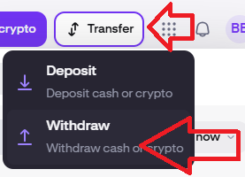

- Select <strong>Tether USD</strong>.

    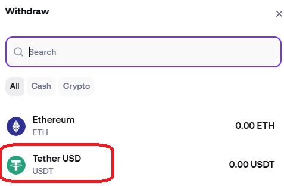

- Choose <strong>Tron</strong> as the network.

    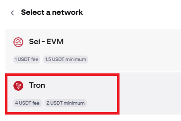

- Configure the <b>Withdrawal address</b>, assigning it to the digital DSJ deposit wallet address you have earlier saved.

    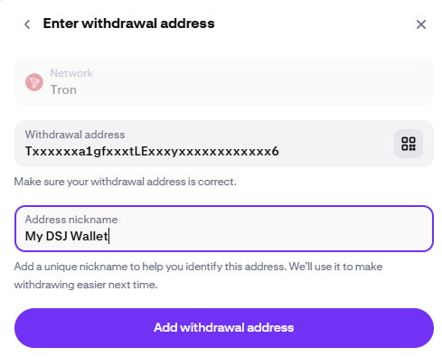

- Enter the amount of USDT stablecoin to transfer to DSJ Exchange, and click <b>Review</b> before proceeding with the transaction. 
  - <b>NOTE: Test with a <u>SMALL</u> amount, as an incorrect entry can result in an unrecoverable loss of assets</b>.  Once you have confirmed your assets have successfully made it to DSJ Exchange, you should feel confident to transfer larger amounts.  

     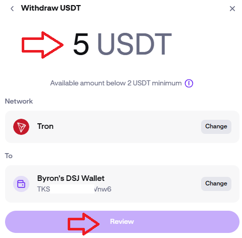

<strong>Confirm Initial DSJ Deposits</strong>

Your initial deposit should be a small amount to ensure you have accurately assigned your digital DSG deposit wallet address.  This is important because an incorrect entry can result in an <b>unrecoverable loss</b> of assets. Once you have confirmed your initial deposit made it successfully into DSJ Exchange, you should feel confident to transfer larger amounts.  This transaction should complete within a couple minutes.

- Confirm the small deposit amount received into your DSJ account
  - Log into you DSJ account and click onto <b>Assets</b>.
  - Observe the <b>Exchange</b> amount, and verify that it is the amount you attempted to deposit.  If you do not see any assets within 30-45 minutes, it was probably unsuccessful.  This should occur near instantaneously.

    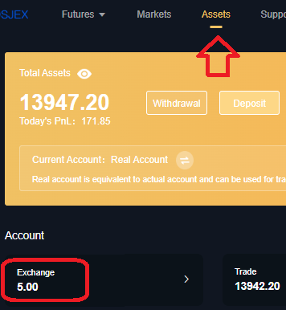

- Return to Kraken and repeat the process to deposit the larger amount, since you have just confirmed that you have accurately assigned the correct digital address.
  

<strong>Transfer DSJ Assets to Trading Wallet</strong>

- From your DSJ account, select <strong>"Assets”</strong>.
- Click <strong>“Transfer”</strong> and fill in the modal window, to move <strong>USDT</strong> from <strong>Exchange</strong> to <strong>Trade</strong>.
- Click <strong>All</strong> to indicate the amount.
- Click <strong>Transfer</strong>, and balances should immediately reflect the transfer.

  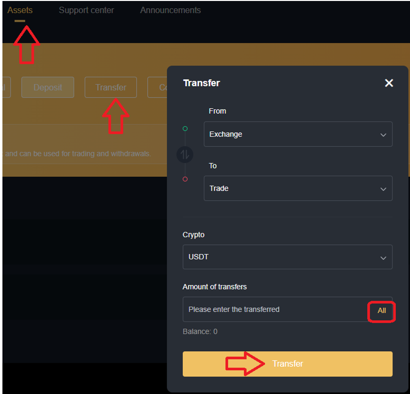

<!--------------------------------------------------------------->
<h2>Bonchat Setup</h2>

<strong>Bonchat Installation</strong>

-	Download and install Bonchat app either by:
    -	official website link https://www.bonchat.live
         - Bonchat also has a desktop app for a PC (optional, but recommended)
    - app store: Search for Bonchat
   - Upon installation, enter “BG2026” for the Server ID, when prompted
     - BG2026 should still be the latest server to which new users are being added.
-	Join with a phone number and password, and a code will be sent to you.

<strong>Bonchat Configuration</strong>

- Click the plus sign to add New Friends. These are bots you will communicate with at times, especially at setup.
  - Elena: Elena03
  -	Professor: Stephen03

  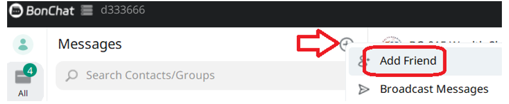
-	Accurately answer all the questions they may ask.  Some responses may include information about your inviter:
    - Byron’s Bonchat ID = u66519436 (or your referrer)
    - Byron’s DSJ Exchange ID = AK7R7TCIPK00 (or your referrer)
    - Your own personal DSJ Exchange ID

- Pay attention to the information they communicate regarding your bonus signals.  Not only do you get additional funds added to you account when you first join, you also get additional trade signals, as a new member.  They will tell you when those signals will occur, so be ready.  You should also communicate this information to yor referrer, who will also be eligible for bonus signals.  Your bonus funds are likely added to your Exchange bucket, so be sure to transfer them to your Trade bucket so they will be included in your compounded profits.     

<!--------------------------------------------------------------->
<h2>Trading</h2>

<strong>Following Regular Signals</strong>

You need to be in DSJ Exchange to follow the signal.  Currently, the two regular signals are distributed around 12:45 PM EST and 6:45 PM EST in Bonchat.  Your signal will be released in chat <b>BG-015 Wealth Sharing Investment Group</b>, unless you are told otherwise.  Be sure you follow the trade by 1:40 and 7:40 respectively.  They give members ample time to get them entered, but I would strongly advise completing them well before 1:30 and 7:30 to be safe.  If you miss it, you lose out!  It is strongly advised to set multiple alarms on you phones to remind you of trade times. Place these trades on your mobile device or PC.

- Go to <strong>Futures</strong>, then <strong>Invited me</strong>
-	Copy the signal code from BonChat (ex: 1EJKAMN4F) into the <strong>Order Code</strong> entry box and click <strong>Confirm</strong>.

    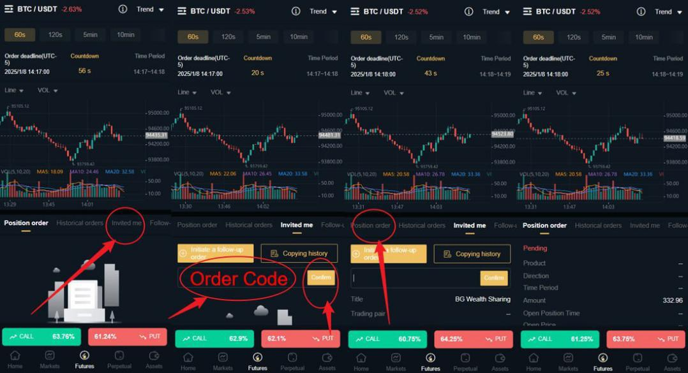

 - Confirm your trade is a Pending Position order.

     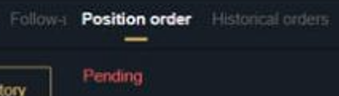

<strong>Following Bonus Signals</strong>

You need to be in DSJ Exchange to follow the signal.  You will have already been notified what day and times they will be available.  There is <b>no Bonchat signal</b> code to copy.  The trade is prefilled for you to just confirm.  If you miss it, you lose out!
- Wait for the "Confirm to follow" to appear.  Refresh screen, if needed, until it displays.

    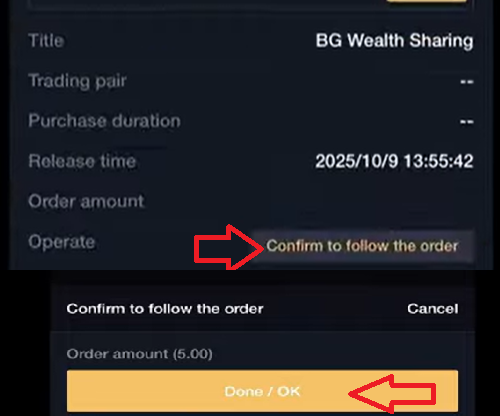

 - Confirm your trade is a Pending Position order.

     

<strong>Follow up on Your Trade</strong>

It is always a good practice to follow up on all the trades that execute.  You always want to ensure that it appears in <b>Position Order</b> in DSJ, when awaiting its execution.  When the trade completes, it will disappear.  <b>Historical Orders</b> is another location you can look to inspect your trade status.  Your account balance (<b>Total Assets</b>) will also increase upon the successful completion of a trade.   I typically just go to BonChat and look for the other participants celebrating another trade win!  In the <strong>rare</strong> case, the trade is not successful, there will be another trade upcoming to overcompensate for the loss.  Be ready!

<!--------------------------------------------------------------->
<h2>Withdraw Profits from DSJ</h2>

<strong>Capture Kraken Wallet Address</strong>

<strong>Notify BG of Kraken Wallet Address</strong>

<strong>Transfer Assets within DSJ from Trade to Exchange</strong>

<strong>Withdraw Assets from DSJ into Kraken</strong>

